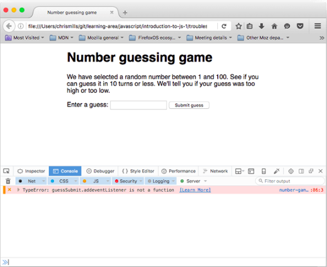
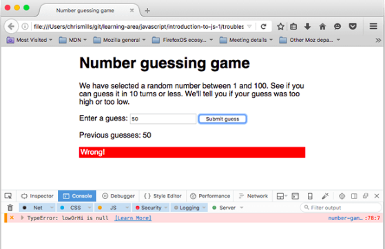
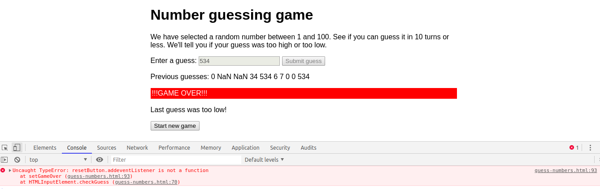

# What went wrong? Troubleshooting JavaScript
- Điều tiên quyết: 
    Trình độ máy tính cơ bản, hiểu được HTML và CSS, JS là gì
- Mục tiêu: 
    Để có được khả năng và sự tự tin để bắt đầu sửa chữa các vấn đề trong mã của riêng bạn.

## Types of error
    Có 2 kiểu lỗi thường xuất hiện: 
        `Systax errors` - Lỗi cú pháp
        `Logic errors`  - Lỗi logic
    
## Fixing syntax errors
<br/>
1. Để biết lỗi xuất hiện từ đâu, bạn sẽ phải mở 
    - Chuột phải -> `inspect`.
    - Hoặc Ctrl + Shift + C hoặc phím F12.
    Bạn sẽ nhìn thấy thông báo lỗi ở bên dưới nếu trong code của bạn xảy ra lỗi.
2. Thành phần của lỗi bao gồm:
    1. 1 dấu đỏ `x` được biểu thị là lỗi.
    2. 1 thông báo lỗi hiển thị lỗi.
    ```js
        TypeError: guessSubmit.addeventListener is not a function
    ```
    3. `Learn more` một liên kết đến MDN trang để giải thích lỗi vừa thông báo.
    4. Tên của tệp JavaScript, liên kết đến tab Trình gỡ lỗi của các công cụ dành cho nhà phát triển. Nếu bạn theo liên kết này, bạn sẽ thấy dòng chính xác nơi lỗi được tô sáng.
    5. Liệt kê lỗi xuất phát ở đâu, cụ thể là `dòng nào : ký tự nào`.
3. Nếu bạn trông thấy lỗi dòng 86: 
```js
guessSubmit.addeventListener('click', checkGuess);
```
4. Thì thông báo lỗi là `guessSubmit.addeventListener is not a function`. Điều này có nghĩa là function `addeventListener` chưa được bạn hoặc JS định nghĩa. 
    -> Nếu không chắc chắn những function, quy tắc mình vừa viết, bạn có thể tìm kiếm theo **mdn tên-tính-năng (name-of-feature)**.
5. Trong hàm trên đã bị sai lỗi chính tả, nghĩa là `addeventListener` phải là `addEventListener`.
    -> Vì JS phân biệt hoa - thường.

## Syntax errors round two (Lỗi cú pháp vòng 2 ).
1. Reload lại trang bạn sẽ thấy hết lỗi trước đó (xảy ra khi bạn fix thành công lỗi). 
2. Bạn thử nhập điều gì đó bất kỳ trong input.. bạn sẽ thấy lỗi
<br/>
3. Lỗi trên được báo cáo: "TypeError: lowOrHi is null", trên dòng 78.
> Note: `Null` là một giá trị đặc biệt, nó là trống hoặc không có giá trị. Vì vậy, lowOrHi đã được khai báo và khởi tạo, nhưng không có bất kỳ giá trị có ý nghĩa nào - nó không có loại hoặc giá trị.
4. Theo dõi code trên dòng 77: 
```js
lowOrHi.textContent = 'Last guess was too high!'
```
5. Kiểm tra các giá trị liên quan đến `textContent` ta thấy:
```js
const guesses = document.querySelector('.guesses');
const lastResult = document.querySelector('.lastResult');
const lowOrHi = document.querySelector('lowOrHi');
const guessSubmit = document.querySelector('.guessSubmit');
const guessField = document.querySelector('.guessField');
``` 
6. Kiểm tra các giá trị được gán.
> Dùng console.log(variableName);
```js
console.log(guesses); // return html ...
console.log(lastResult); // return html ...
console.log(lowOrHi); // null
console.log(guessSubmit); // return html ...
console.log(guessField); // return html ...
```
7. Ra trình duyệt và tải lại trang để thấy điều này.
8. Ta thấy ở đây sử dụng `document.querySelector('lowOrHi')` là function trả về kết quả phần tử HTML. Nhưng với lowOrHi bản thân biến này được gắn 
```html
    <p class="lowOrHi"></p>
```
kết quả trả về `null` điều này có nghĩa là sai.
9. ở `8` `lowOrHi` là 1 class trong hàm `document.querySelector('lowOrHi')` thêm `.` thành 
```js
    document.querySelector('.lowOrHi');
```
10. Lưu lại và Refesh lại trang lần nữa!

## Syntax errors round three (cú pháp lỗi vòng 3).
1. Kiểm thử (Testing) chương trình 1 lần nữa. Nhập hết các số, cho đến khi trò chơi kết thúc. Lúc này xuất hiện thêm lỗi:
<br/>
2. Xuất hiện thông báo khi kết thúc chương trình như hình trên.
3. Tìm function `addeventListener` và fix thành `addEventListener` như `lỗi 1`.
Cuối cùng, Kiểm tra lại lần nữa và bạn sẽ thấy lỗi đã hết.

## A logic error
Khi bạn kiểm thử trò chơi nhiều lần, bạn thấy cách mà trò chơi hoạt động không ổn. Bạn chắc chắn sẽ nhận thấy rằng số "ngẫu nhiên" bạn phải đoán luôn là 1.

Lỗi logic thường xảy ra có thể nhìn thấy rõ ràng nhất là chương trình không chạy theo đúng ý định của vấn đề đã được đưa ra trước đó (Không đúng ý định chạy). Để fix lỗi này bạn cần xem lại các bước xử lý logic một lần nữa.

# Other common errors
Có những lỗi phổ biến khác mà bạn sẽ gặp trong mã của mình. Phần này làm nổi bật hầu hết trong số họ.

## SyntaxError: missing ; before statement
Lỗi này thường có nghĩa là bạn đã bỏ lỡ một `dấu chấm phẩy` ở cuối một trong các dòng mã của bạn, nhưng đôi khi nó có thể khó hiểu hơn.
Cho ví dụ:
```js
var userGuess = Number(guessField.value); //true
// to
var userGuess === Number(guessField.value); //false or NaN

// 2
var foo = 'Tom's bar';
// SyntaxError: missing ; before statement
// to
var foo = "Tom's bar";
var foo = 'Tom\'s bar';

var obj = {};
var obj.foo = 'hi'; // SyntaxError missing ; before statement
// to
var obj = {};
obj.foo = 'hi';
```
[Bạn có thể tìm hiểu chi tiết tại đây](https://developer.mozilla.org/en-US/docs/Web/JavaScript/Reference/Errors/Missing_semicolon_before_statement)

## The program always says you've won, regardless of the guess you enter
Chương trình luôn nói rằng bạn đã thắng, bất kể bạn đoán là gì.

> Note: Kiểm tra lần nữa các toán tử điều kiện hay giá trị trả về ở dạng `bool` đã đúng chưa. 
## SyntaxError: missing ) after argument list
Mất `)` sau danh sách đối số hoặc sai cú pháp trước dấu `)`.
ví dụ:
```js
false
console.log('PI: ' Math.PI);
// SyntaxError: missing ) after argument list

true
console.log('PI: ' + Math.PI);
// "PI: 3.141592653589793"

// =========
// chuỗi chưa hoàn thành
console.log('"Java" + "Script" = \"' + 'Java' + 'Script\");
// SyntaxError: missing ) after argument list

// true
console.log('"Java" + "Script" = \"' + 'Java' + 'Script\"');
// '"Java" + "Script" = "JavaScript"'
```

[Bạn có thể xem thêm tại đây](https://developer.mozilla.org/en-US/docs/Web/JavaScript/Reference/Errors/Missing_parenthesis_after_argument_list)

## SyntaxError: missing : after property id
Lỗi này thường liên quan đến một đối tượng JavaScript được hình thành không chính xác, nhưng trong trường hợp này, chúng tôi đã quản lý để có được nó bằng cách thay đổi:
```js
// true
function checkGuess() {

// to false
function checkGuess( {
```
## SyntaxError: missing } after function body
Lỗi này là do mất dấu `}` trong 1 function nào đó. Các giải quyết là comment code theo dấu `{` để tìm vị trí `}`.

## SyntaxError: expected expression, got 'string' or SyntaxError: unterminated string literal
SyntaxError: biểu thức mong đợi, có 'chuỗi' hoặc SyntaxError: chuỗi ký tự không hoàn chỉnh.
> Những lỗi này thường có nghĩa là bạn đã bỏ dấu ngoặc kép mở hoặc đóng của giá trị chuỗi. 
Trong lỗi đầu tiên ở trên. chuỗi sẽ được thay thế bằng (các) ký tự không mong muốn mà trình duyệt tìm thấy thay vì dấu ngoặc kép ở đầu chuỗi. Lỗi thứ hai có nghĩa là chuỗi chưa được kết thúc bằng dấu ngoặc kép.

> Bạn có thể xem thêm [SyntaxError: Unexpected token](https://developer.mozilla.org/en-US/docs/Web/JavaScript/Reference/Errors/Unexpected_token) và [SyntaxError: unterminated string literal](https://developer.mozilla.org/en-US/docs/Web/JavaScript/Reference/Errors/Unterminated_string_literal) trên trang tham khảo để biết thêm chi tiết về những lỗi này.


